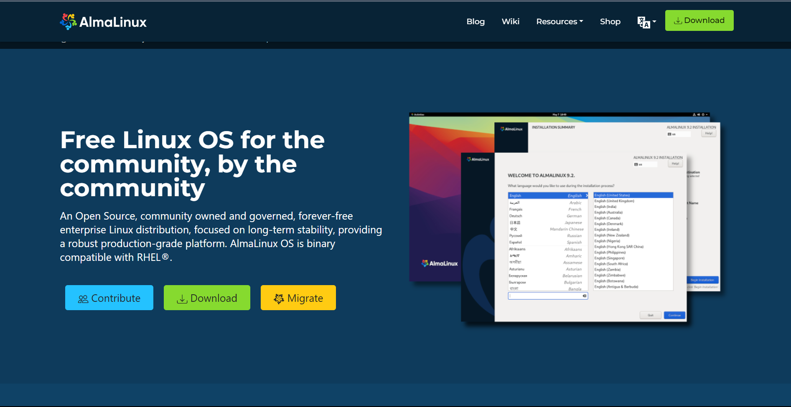

# Cara Instalasi AlmaLinux melalui VirtualBox

Laporan Praktikum Sistem Operasi

#### 1. Pertama siapkan file OS AlmaLinux. Install di situs resminya https://almalinux.org/ pilih sesuai kebutuhan

#### 2. Selanjutnya buka VirtualBox dan buat server masukkan file iso tersebut

#### 3. Setelah itu buka settings, pilih system lalu "boot order" pindahin optical ke atas

#### 4. Lalu jalankan

#### 5. Selanjutnya Pilih bahasa yang diinginkan dan lanjutkan

#### 6. Kita akan masuk “Installation Summory” yang dimana untuk mengatur dan mengecek semua tools yang ada didalamnya

#### 7. Setelah itu klik “Root Password” untuk membuat kata sandi

#### 8. Lalu klik “Time & Date” untuk melihat jam dan tanggal pada tampilan tersebut

#### 9. Setelah mengisi “User Settings” kita hanya perlu melengkapi satu hal terakhir pada menu “System” kita klik “Installation Destination

#### 10. Selanjutnya mulai instalasi dan tunggu prosesnya

#### 11. Setelah instalasi itu klik “Repoot System”, lalu akan seperti berikut ini

#### 12. Lalu masukkan username dan password

#### 13. Ini tampilan hasilnya

